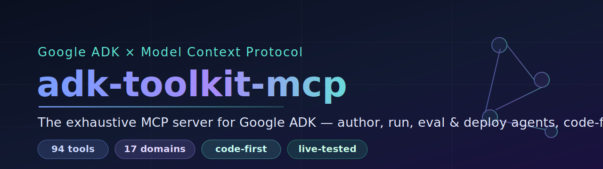
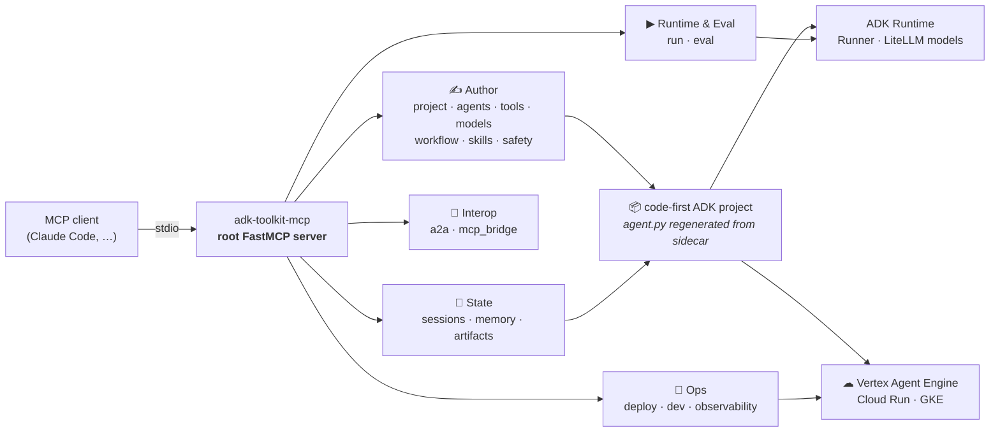
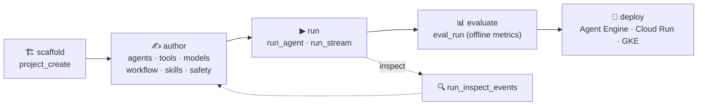
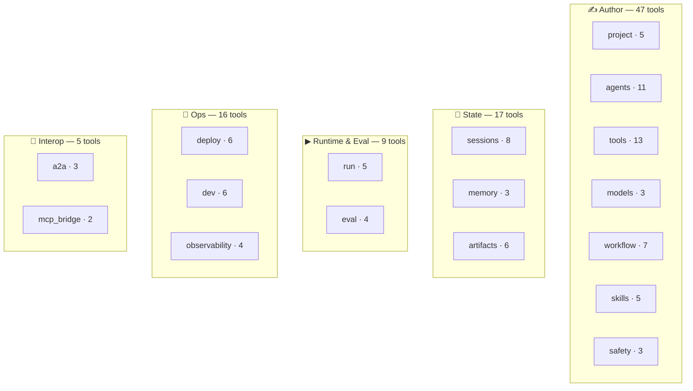

<div align="center">



# adk-toolkit-mcp

[](https://github.com/Casius999/adk-toolkit-mcp/actions/workflows/ci.yml)
[](https://www.python.org/)
[](LICENSE)
[](https://modelcontextprotocol.io/)
[](https://pypi.org/project/google-adk/)
[](#-testing--quality)
[](#-testing--quality)
[](https://github.com/astral-sh/ruff)
[](https://mypy-lang.org/)

**The most exhaustive [Model Context Protocol](https://modelcontextprotocol.io/) server for Google [ADK](https://google.github.io/adk-docs/) — `94` tools across `17` domains to scaffold, compose, run, evaluate, and deploy ADK agents, code-first.**

[Quickstart](#-quickstart) · [Architecture](#-architecture) · [Domains](#-the-17-domains-94-tools) · [Verified live](#-verified-end-to-end) · [Guided UX](#-guided-experience) · [Docs](#-docs)

</div>

---

`adk-toolkit-mcp` turns the **entire Google ADK surface** into Model Context Protocol tools. An
agent — or you — builds a complete, runnable, deployable ADK project end to end without leaving
the MCP client, and the output is **real ADK Python you own**, not a black box. It tracks the
**SOTA as of June 2026**: `google-adk` 2.1.x including the ADK 2.0 **Workflow graph engine**, the
**Skill Registry**, and **planners**.

### ✨ Highlights

- **Full ADK surface — 94 tools / 17 domains.** agents · tools · models · **workflow (graph engine)** · **skills (registry)** · sessions · memory · artifacts · run · eval · deploy · dev · a2a · mcp_bridge · safety · observability · project.
- **Code-first.** A sidecar (`.adk_toolkit/agents.json`) is the source of truth; `agent.py` is regenerated wholesale and is always `ast.parse` + `ruff format` + isort clean — **commit it, deploy it, read it.**
- **Verified live, end-to-end.** A gated test drives a *real* model through the mounted server (`project_create → agents_create_llm → models_configure_litellm → run_agent`) and asserts a real response. [See it →](#-verified-end-to-end)
- **Latest orchestration.** The ADK 2.0 **Workflow graph engine** (nodes · conditional/cyclic edges · ReAct loops · join · `Workflow` as root), **Agent Skills** (SKILL.md + `SkillToolset`), and **planners** (`BuiltInPlanner` / `PlanReActPlanner`).
- **Token-efficient.** Opt-in **Code Mode** collapses the 94-tool catalog to a 4-tool discovery surface.
- **Provider-agnostic.** Gemini natively, plus Anthropic / OpenAI / Ollama / LM Studio / NVIDIA NIM / any OpenAI-compatible endpoint via LiteLLM.
- **Companion skill.** An `adk-toolkit` Claude skill (14 reference files) teaches the ADK craft and maps every task to the exact tool.
- **755 tests, ~95% coverage**, `ruff` + `mypy` clean (incl. `--platform linux`), CI on Python 3.11 & 3.12.

---

## 🏛 Architecture



Each domain is a mounted `FastMCP` sub-server (namespaced tools, `{ok, data, error}` envelope).
The toolkit **writes real ADK code**; the ADK Runtime and Google Cloud do the execution.
Details: [`docs/ARCHITECTURE.md`](docs/ARCHITECTURE.md).

## 🔄 The lifecycle



---

## ⚡ Quickstart

```text
# 1. Scaffold
project_create(path="/proj", app_name="greeter", model="gemini-2.5-flash", backend="ai_studio")

# 2. Author an agent + a tool, set it as root
agents_create_llm(path="/proj", app_name="greeter", name="assistant",
                  instruction="Greet the user warmly.")
tools_add_function(path="/proj", app_name="greeter", agent_name="assistant",
                   func_name="get_greeting", params=[{"name": "name", "type": "str"}],
                   docstring="Return a greeting.", body='return {"greeting": f"Hello, {name}!"}')
agents_set_root(path="/proj", app_name="greeter", name="assistant")

# 3. Run one turn (Gemini → GOOGLE_API_KEY; or wire any provider via models_configure_litellm)
run_agent(path="/proj", app_name="greeter", user_id="u1", session_id="s1", message="Greet Alice")
```

### Install

```bash
# Run without cloning (once published) via uvx:
uvx --from git+https://github.com/Casius999/adk-toolkit-mcp adk-toolkit-mcp

# Or from a clone (recommended for development):
git clone https://github.com/Casius999/adk-toolkit-mcp && cd adk-toolkit-mcp
uv venv && uv sync --extra dev      # add --extra all for every optional backend
```

A PyPI release (`pip install adk-toolkit-mcp`) is planned.

<details>
<summary><b>Optional extras</b> — tools whose backend isn't installed return an actionable error, never a crash</summary>

| Extra | Enables |
|---|---|
| `litellm` | Non-Gemini models (OpenAI, Anthropic, Ollama, LM Studio, NVIDIA NIM, …) |
| `gcp` | Vertex AI session/memory/artifact backends |
| `bigquery` / `spanner` | BigQuery / Spanner toolsets |
| `a2a` | Agent-to-Agent — expose/consume A2A agents |
| `eval` | Offline evaluation metrics (ROUGE + tool trajectory) |
| `mcp` | MCP toolset support in generated agents |
| `community` | LangChain / CrewAI tool wrappers |
| `db` | `DatabaseSessionService` via SQLAlchemy |
| `all` | Everything above |

</details>

### MCP client config

```json
{
  "mcpServers": {
    "adk-toolkit": {
      "command": "uv",
      "args": ["run", "adk-toolkit-mcp"],
      "cwd": "/absolute/path/to/adk-toolkit-mcp"
    }
  }
}
```

> Runs on **stdio**. MCP-registry-ready manifest in [`server.json`](server.json) (the MCP registry is in public preview). Targets MCP spec revision **2025-11-25**.

---

## 🧩 The 17 domains (94 tools)



| Domain | # | Covers |
|---|--:|---|
| `project` | 5 | Scaffold app, inspect, `.env`, extras, agent-config YAML |
| `agents` | 11 | LlmAgent · Sequential/Parallel/Loop · custom · compose · as-tool · root · **planner** |
| `tools` | 13 | Function · long-running · builtins · AgentTool · OpenAPI · BigQuery · Spanner · MCP toolset · APIHub · LangChain · CrewAI · auth |
| `models` | 3 | Gemini · LiteLlm (any provider) · `GenerateContentConfig` + safety |
| **`workflow`** | 7 | **ADK 2.0 graph engine** — nodes · conditional/cyclic edges · join · `Workflow` root |
| **`skills`** | 5 | **Agent Skill Registry** — SKILL.md skills · `SkillToolset` attach |
| `safety` | 3 | Callback guardrails · global plugins · Gemini safety + LLM-call budget |
| `sessions` | 8 | Backend · CRUD · state (`app:`/`user:`/`temp:`) · append event |
| `memory` | 3 | Backend · ingest session · search (keyword / Vertex RAG) |
| `artifacts` | 6 | Backend · save/load (versioned) · list · delete · versions |
| `run` | 5 | Execute (sync/SSE/live) · build `RunConfig` · inspect events — agents **and** workflows |
| `eval` | 4 | Create evalset · criteria · run · report |
| `deploy` | 6 | Agent Engine · Cloud Run · GKE · Dockerfile · preflight · status |
| `dev` | 6 | `adk web` · `adk api_server` · one-shot run · stop/status/logs |
| `a2a` | 3 | Consume remote A2A · expose over A2A · build AgentCard |
| `mcp_bridge` | 2 | Convert ADK tools to MCP schemas |
| `observability` | 4 | OpenTelemetry · Cloud Trace · third-party OTLP · trace view |

Plus 2 resources (`adk://version`, `adk://models`) and 5 [workflow prompts](#-guided-experience).
Full reference: [`docs/TOOL_CATALOG.md`](docs/TOOL_CATALOG.md).

---

## ✅ Verified end-to-end

The toolkit's job is the **plumbing**: scaffold a project, wire a model, run the agent through
ADK's real `Runner`, and return the model's response over MCP. A gated integration test
([`tests/integration/test_e2e_kimi.py`](tests/integration/test_e2e_kimi.py)) drives a **real
OpenAI-compatible model** end to end through the *mounted* server and asserts a real response
flows back. CI-safe by construction — it **skips** unless you provide a key and opt in:

```bash
# Put a key in a gitignored .env, e.g. NVIDIA_API_KEY=nvapi-...
ADK_TOOLKIT_TEST_LIVE=1 uv run pytest tests/integration/test_e2e_kimi.py -s
```

Point the same flow at **any** OpenAI-compatible endpoint (NVIDIA NIM, OpenAI, Anthropic, Ollama,
LM Studio) via `models_configure_litellm(...)`. The key is read from the environment at run time
and is **never** written into generated code (`api_key=os.getenv("...")`). Two
[`examples/`](examples/) run fully offline (no key).

---

## 🧭 Guided experience

Three on-ramps make the 94-tool surface approachable:

| On-ramp | What it gives you |
|---|---|
| 🧠 **Companion skill** (`skill/`) | The `adk-toolkit` Claude skill — a routing index + 14 reference files (mental model, decision trees, gotchas, task→tool catalog). `cp -r skill/. ~/.claude/skills/adk-toolkit/` |
| 📝 **Workflow prompts** (MCP `get_prompt`) | `scaffold_multi_agent` · `add_guardrail` · `write_evalset` · `deploy_checklist` · `debug_agent` — each emits the exact tool-call sequence for a multi-step task |
| 📂 **Examples** (`examples/`) | `01_hello_agent.py` (live model) · `02_multi_agent.py` (offline) · `03_eval.py` (offline) |

### 🪶 Code Mode (opt-in)

```text
default:    94 tools exposed by name
code mode:   4 discovery tools  →  search · get_schema · tags · execute
```

```bash
ADK_TOOLKIT_CODE_MODE=1 uv run adk-toolkit-mcp     # or build_server(code_mode=True)
```

Uses FastMCP's **experimental Code Mode** transform (since 3.1+; latest stable 3.3.1). All tools
are tagged by domain. The discovery tools need no extra deps; the `execute` sandbox needs
`uv pip install 'fastmcp[code-mode]'` (details: [`docs/adk-api-notes/fastmcp-codemode.md`](docs/adk-api-notes/fastmcp-codemode.md)).

---

## 🔬 Testing & quality

- **755 tests** + 1 gated live E2E — **~95% line coverage**, green under `-W error::DeprecationWarning`.
- `ruff` (lint + format) and `mypy` clean — including **`mypy --platform linux`** (CI runs on Linux).
- **CI** on Python **3.11 & 3.12** ([`.github/workflows/ci.yml`](.github/workflows/ci.yml)); the package ships `py.typed`; `uv build` yields a clean wheel + sdist.
- Generated `agent.py` is validated (`ast.parse` + `ruff format` + `ruff check --select I`) before it lands.

```bash
uv run ruff check . && uv run mypy src && uv run pytest --cov
```

---

## 📚 Docs

| | |
|---|---|
| [`docs/ARCHITECTURE.md`](docs/ARCHITECTURE.md) | Root server, sub-server mounts, code-first sidecar, `project_model`, `runtime`, `run_core`, `adk_cli`, Code Mode |
| [`docs/TOOL_CATALOG.md`](docs/TOOL_CATALOG.md) | All 94 tools by domain, with purpose + key parameters |
| [`docs/CONTRIBUTING.md`](docs/CONTRIBUTING.md) | Dev setup, conventions, how to add a domain |
| [`docs/adk-api-notes/`](docs/adk-api-notes/) | Per-domain ADK API introspection notes (implementation ground truth) |
| [`CHANGELOG.md`](CHANGELOG.md) · [`SECURITY.md`](SECURITY.md) · [`CODE_OF_CONDUCT.md`](CODE_OF_CONDUCT.md) | Release notes · security policy · code of conduct |

---

## 📄 License

[Apache-2.0](LICENSE). Built on [Google ADK](https://google.github.io/adk-docs/) and
[FastMCP](https://gofastmcp.com/). Not affiliated with Google.
